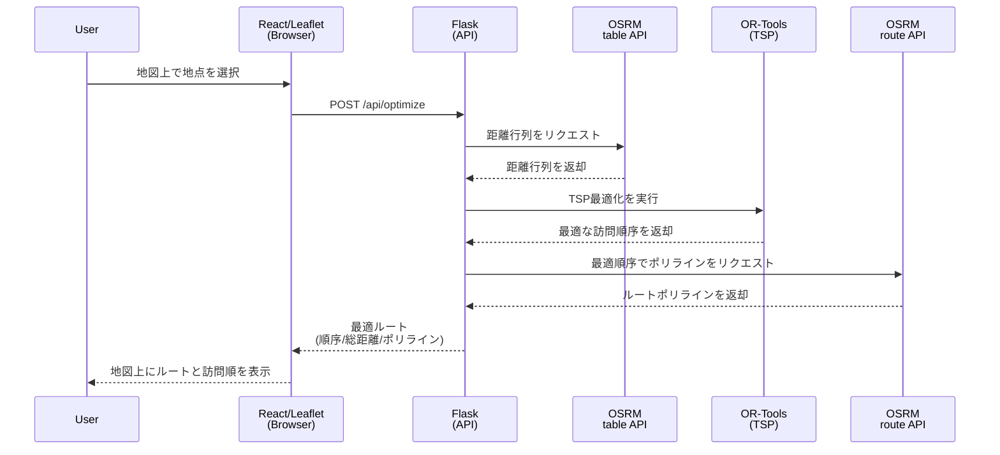

# ルート最適化 Web アプリケーション MVP 設計書

本書は「docs/Requirements.md」の要件に基づく、MVP版ルート最適化 Web アプリケーション（巡回セールスマン問題/TSP、車両1台）の設計指針を示す。

## 1. 目的とスコープ
- 目的: Depot（始点/終点）から出発して全訪問地点を1度ずつ巡回し、Depotに戻る最短ルートを計算・可視化する。
- スコープ（MVP）:
  - 車両数: 1（TSP）
  - 最適化目標: 総移動距離の最小化
  - 上限: 訪問地点数は**10地点**まで
  - 永続化: なし（ブラウザのセッション内での状態保持のみ）
  - 距離・ルート形状: OSRM 公開デモAPIの利用

## 2. 全体アーキテクチャ
- フロントエンド（React + TypeScript, Leaflet）
  - 地図表示、地点登録（Depot/訪問地点）、削除、ルートと訪問順の表示、サマリー表示、最適化実行のトリガ。
- バックエンド（Python, Flask + OR-Tools）
  - 入力バリデーション、OSRMを用いた距離行列生成、OR-ToolsによるTSP解法、OSRMを用いたルート形状取得、結果整形。
- 外部サービス
  - OSRM（Open Source Routing Machine）: `table`（距離行列）および `route`（ルート形状）API を利用。

論理構成イメージ:



## 3. モジュール構成（提案）

フロントエンド（例: `frontend/`）
- `src/components/MapView.tsx`: Leaflet マップ、クリックで地点追加、マーカー描画、ルートポリライン描画、マーカー上の訪問順番号表示
- `src/components/Controls.tsx`: 最適化ボタン、リセットボタン、エラーメッセージ表示エリア
- `src/components/Summary.tsx`: 総移動距離、訪問順序のリスト表示
- `src/services/api.ts`: API クライアント（`/api/optimize`, `/api/health`）
- `src/types/index.ts`: `LatLng`, `OptimizeRequest`, `OptimizeResponse` 等の型定義
- 状態管理は React のローカルステート（`useState`, `useReducer`）で対応可能。

バックエンド（例: `server/`）
- `app.py`: Flask アプリケーションのエントリポイント。ルーティング、CORS設定、レート制限の適用。
- `schemas.py`: Pydantic を用いた入出力データスキーマ定義とバリデーション。
- `osrm_client.py`: OSRM API（table/route）へのリクエストを責務とするモジュール。タイムアウト、リトライ、エラーハンドリングを内包。
- `solver.py`: OR-Tools を用いてTSPを解くロジックをカプセル化。
- `config.py`: 環境変数から設定を読み込むモジュール（地点上限、タイムアウト、OSRM URL 等）。

## 4. データモデル

フロントエンド型定義（TypeScript）
```ts
type LatLng = { lat: number; lng: number };

type OptimizeRequest = { 
  depot: LatLng; 
  locations: LatLng[]; 
};

type OptimizeResponse = {
  // `locations`配列のインデックスを、Depotから出発して巡回する順に並べたもの。
  // 例: [2, 0, 1] は Depot -> locations[2] -> locations[0] -> locations[1] -> Depot の順を示す。
  route: number[];
  
  // 総走行距離（メートル単位）
  total_distance: number;
  
  // 各移動区間（レグ）のルート形状を表すポリラインの配列。
  // 例: [ (Depot -> loc[2]), (loc[2] -> loc[0]), ..., (loc[1] -> Depot) ]
  route_geometries: string[];
};
```

バックエンド（概念）
- `Coords: List[Tuple[float, float]]`: `[depot, loc1, loc2, ...]` の順で座標を格納。
- `DistanceMatrix: List[List[int]]`: OSRMから取得したメートル単位の距離行列。
- **設計ルール**: 内部処理では、Depot を常にインデックス `0` として扱う。

## 5. API 設計

- `POST /api/optimize`
  - Request Body: `{ "depot": { "lat": number, "lng": number }, "locations": [{ "lat": number, "lng": number }, ...] }`
  - Success Response (200 OK): `{ "route": number[], "total_distance": number, "route_geometries": string[] }`
  - Error Responses:
    - 400 Bad Request: バリデーションエラー（座標不正、地点数不足/超過、Depot未設定）。
    - 429 Too Many Requests: レート制限超過。
    - 502 Bad Gateway: 外部サービス（OSRM）への接続・リクエスト失敗。
    - 500 Internal Server Error: その他のサーバー内部エラー。

- `GET /api/health`
  - Response (200 OK): `{ "status": "ok" }`

- エラーレスポンス形式
```json
{
  "error": "エラーの種類", 
  "message": "ユーザーフレンドリーな説明"
}
```
例: `{ "error": "INVALID_LOCATION_COUNT", "message": "訪問地点は1から10の間で設定してください。" }`

## 6. 処理フロー

1.  **地点入力（フロントエンド）**:
    - ユーザーがマップをクリック。
    - 最初のクリック地点を `depot` として登録。2回目以降のクリックは `locations` 配列に追加。
    - マーカーには削除ボタンを設け、個別削除を可能にする。リセットボタンで全地点をクリア。
    - `locations` の数が上限（10）を超えた場合、UI上で警告し、それ以上追加できないようにする。

2.  **最適化実行（フロントエンド）**:
    - ユーザーが「最適化」ボタンをクリック。
    - リクエスト中はローディングスピナーを表示し、ボタンを無効化する。
    - `POST /api/optimize` をリクエスト。

3.  **バックエンド処理**:
    - **バリデーション**: Pydantic スキーマでリクエストボディを検証（座標の型/範囲、地点数、Depotの存在）。
    - **距離行列生成**: `depot` と `locations` を結合した座標リストを作成し、OSRM `table` API を1回呼び出して距離行列を取得。
    - **TSP解法**: 取得した距離行列を基に、OR-Tools を用いて最適巡回順序を計算する。Depot（インデックス 0）を始点・終点として設定。
    - **ルート形状取得**: 計算された最適順序に基づき、座標を並べ替える (`Depot -> loc[i] -> loc[j] ... -> Depot`)。この順序で OSRM `route` API を1回呼び出し、レスポンスの `legs` 配列から各区間のポリライン (`geometry`) を抽出。
    - **レスポンス整形**: フロントエンドの求める形式（`route`, `total_distance`, `route_geometries`）に整形して返却。

4.  **結果表示（フロントエンド）**:
    - 既存のマーカーとポリラインをクリア。
    - レスポンスの `route_geometries` を使用して、地図上に最適ルートをポリラインで描画。
    - マーカー上に訪問順（1, 2, 3...）を示す番号を表示。
    - `route` フィールドに含まれる訪問順序に基づき、マーカーとサマリーを更新。
    - サマリーエリアに総距離（kmに換算）と訪問順リストを表示する。

## 7. アルゴリズム詳細（OR-Tools）

- **インデックス管理**:
  - 0: Depot, 1..N: 訪問地点（`locations`配列に対応）。
- **距離コールバック**:
  - OSRM `table` API から取得した距離行列を `RoutingModel.RegisterTransitCallback` に登録。
- **検索パラメータ（MVP）**:
  - First Solution Strategy: `PATH_CHEAPEST_ARC` （最初に見つける解の発見戦略）
  - Local Search Metaheuristic: `GUIDED_LOCAL_SEARCH` （局所探索による解の改善戦略）
  - Time Limit: 計算時間上限を3秒（3000ms）に設定し、応答性能を担保。
- **出力処理**:
  - ソルバーから得られるノードインデックスの巡回順（例: `0 -> 3 -> 1 -> ... -> 0`）を取得。
  - Depot（0）を除外し、`locations` 配列に対応するインデックス（`node_index - 1`）に変換して `route` を生成。
  - `solver.ObjectiveValue()` から総移動距離を取得。

## 8. OSRM 連携

- **Base URL**: 環境変数 `OSRM_BASE_URL` で設定（例: `https://router.project-osrm.org`）。
- **Table API（距離行列）**:
  - `GET /table/v1/driving/{lon,lat;...}?annotations=distance`
  - `depot` と `locations` の全座標をセミコロンで連結して指定。
  - 単位はメートル。
- **Route API（ルート形状）**:
  - `GET /route/v1/driving/{lon,lat;...}?overview=full&geometries=polyline6`
  - 最適化後の巡回順で座標を連結して指定。
  - 応答の `legs` 配列をイテレートし、各 `leg` の `geometry` を抽出して `route_geometries` を構築。
- **タイムアウトとリトライ**:
  - 接続タイムアウト3秒、読み込みタイムアウト7秒を設定。
  - MVPではリトライは実装せず、失敗した場合は即座に 502 Bad Gateway を返す。

## 9. エラーハンドリング

- **フロントエンド**: APIからのエラーレスポンスを受け取り、`message` をユーザーに分かりやすく表示する。
- **バックエンド**:
  - **バリデーション**: 緯度(-90..90)、経度(-180..180)、数値型、`locations` 配列の要素数（1..10）を厳密にチェック。
  - **外部サービス連携**: OSRMからの非200応答やタイムアウトを検知し、適切なエラー（502）を生成。
  - **共通**: 予期せぬ例外はすべて捕捉し、エラー情報をロギングした上で、汎用的な 500 エラーを返す。

## 10. パフォーマンス設計

- **目標**: 10地点の最適化リクエストに対し、5秒以内に結果を描画完了させる。
- **施策**:
  - **APIコール**: 距離行列（`table`）、ルート形状（`route`）の取得は、それぞれ1回のAPIコールで完結させる。
  - **計算時間**: OR-Toolsの計算時間に上限（3秒）を設定。
  - **キャッシュ**: （将来拡張）同一座標セットに対するOSRM応答を短時間（例: 60秒）メモリキャッシュ（Redis等）することを検討。
  - **並行処理**: 本番環境では、Gunicorn等のWSGIサーバーを使用し、複数のワーカープロセスでリクエストを並列処理する。

## 11. セキュリティ

- **CORS**: フロントエンドのデプロイ先オリジンを環境変数で指定し、ホワイトリスト方式で許可する。
- **レート制限**: `flask-limiter` 等のライブラリを使用し、IPアドレス単位でAPIリクエスト数を制限（例: 60リクエスト/分）。
- **入力検証**: ペイロードサイズ制限をWebサーバー（Nginx等）で設定。座標や地点数のバリデーションを徹底する。
- **タイムアウト**: すべての外部API呼び出しにタイムアウトを設定し、リソースの枯渇を防ぐ。

## 12. UI/UX 指針（MVP）

- **地図**: 初期表示は日本中心、ズームレベル4程度。
- **マーカー**: Depotは青、訪問地点は赤など色分け。最適化後はマーカー上に訪問順番号（1, 2, ...）をバッジで表示。
- **操作性**:
  - クリックで地点追加。
  - マーカークリックでポップアップ表示し、その中に「削除」ボタンを設置。
  - 「全消去」ボタンでDepotと全訪問地点をリセット。
- **フィードバック**: 最適化ボタン押下後は、処理中であることが分かるローディングインジケータを表示する。エラー発生時は、内容を簡潔に通知する。

## 13. デプロイ/運用

- **デプロイ先（MVP）**:
  - フロントエンド: Cloudflare Pages（静的ビルドをデプロイ）
  - バックエンド: Google Cloud Run（コンテナをデプロイ）
- **コンテナ化**: 本番はバックエンド（Python/Flask）のみコンテナ化して Cloud Run にデプロイする。フロントエンドは静的サイトとしてビルドし、Cloudflare Pages にデプロイする。ローカル開発では必要に応じて Docker Compose でAPIやモックと連携。
- **環境変数**:
  - `OSRM_BASE_URL`
  - `CORS_ALLOWED_ORIGINS`
  - `MAX_LOCATIONS`
  - `RATE_LIMIT_RULE` (例: `60 per minute`)
  - `SOLVER_TIME_LIMIT_MS`
- **監視**: `/api/health` エンドポイントを定期的に監視。アクセスログとエラーログ（特に5xx系）を収集・監視する仕組みを導入。
  - Cloud Run: サービスのリクエスト/エラーレート、レイテンシ、再起動回数を可視化。
  - Cloudflare Pages: デプロイ履歴とエラーログを確認。

## 14. テスト方針

- **ユニットテスト (Backend)**:
  - `solver.py`: 固定の距離行列に対し、期待される巡回順と総距離を返すか検証。
  - `osrm_client.py`: OSRM API のモックを使用し、正常応答・異常応答のパースやエラーハンドリングを検証。
- **結合テスト (Backend)**:
  - `/api/optimize` エンドポイントに対し、正常系・異常系（境界値、不正な入力）のリクエストを送信し、期待通りのHTTPステータスコードとレスポンスボディが返るか検証。
- **E2Eテスト (Frontend)**:
  - PlaywrightやCypress等のツールを使用し、ユーザー操作（地点追加、最適化実行、結果表示）のシナリオを自動テスト。

## 15. 制約と将来拡張

- **MVPの制約**:
  - 車両は1台のみ。容量制約や時間窓制約は考慮しない。
  - データは永続化されず、リロードでリセットされる。
  - OSRMの公開デモサーバーに依存するため、商用利用や高負荷な利用は不可。
- **将来拡張**:
  - **複数車両対応 (VRP)**: 複数台の車両でのルート最適化。
  - **各種制約対応**: 時間窓、車両容量、滞在時間などの制約を追加。
  - **データ永続化**: 最適化結果の保存、共有、履歴の呼び出し機能。
  - **交通状況の考慮**: リアルタイム交通情報を反映したルート計算（OSRMでは困難、別サービス検討）。

## 16. 擬似コード（参考）

バックエンド主要処理 (`app.py` or `views.py`)
```python
def optimize_route(request_data: OptimizeRequest):
    # Pydantic等でバリデーションは完了済みとする
    depot = request_data.depot
    locations = request_data.locations
    
    # 1. 座標リスト作成 (depotがインデックス0)
    all_coords = [depot] + locations
    
    # 2. 距離行列を取得
    dist_matrix = osrm_client.get_distance_matrix(all_coords)
    
    # 3. TSPを解く
    node_order, total_dist = solver.solve_tsp(dist_matrix) # 例: [0, 3, 1, 2, 4, 0]
    
    # 4. locationsのインデックスに変換
    route = [idx - 1 for idx in node_order if idx != 0] # 例: [2, 0, 1, 3]

    # 5. ルート形状を取得
    ordered_coords = [all_coords[i] for i in node_order]
    geometries = osrm_client.get_route_geometries(ordered_coords)
    
    # 6. レスポンスを構築
    return { 
        "route": route, 
        "total_distance": total_dist, 
        "route_geometries": geometries 
    }
```

フロントエンド表示ロジック (`MapView.tsx`)
```tsx
const handleOptimize = async () => {
  setLoading(true);
  setError(null);
  try {
    const response = await api.optimize({ depot, locations });
    // 既存のルートをクリア
    clearMapLayers();
    // 新しいルートを描画
    drawPolylines(response.route_geometries);
    // マーカーに訪問順を表示
    updateMarkersWithOrder(response.route);
    // サマリーを更新
    setSummary({ 
      distance: response.total_distance / 1000, // kmに変換
      order: response.route 
    });
  } catch (err) {
    setError(err.response.data.message || 'エラーが発生しました。');
  } finally {
    setLoading(false);
  }
};
```
